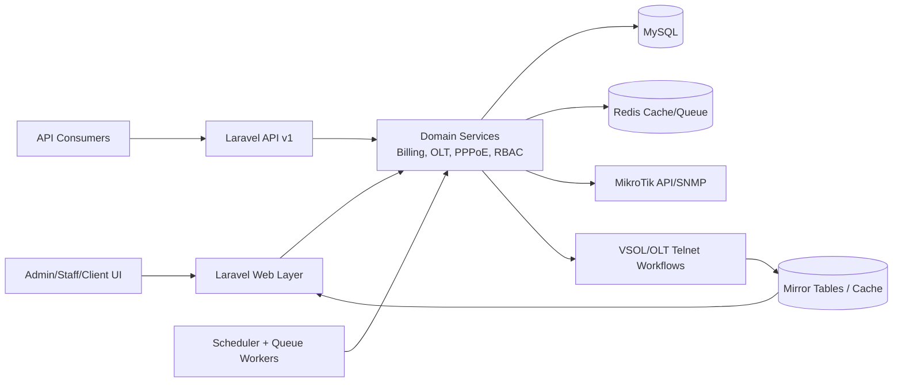

# 🚀 MDR ISP Billing System (Rajamehar Online)

A modern ISP operations and billing platform built for fast, reliable subscriber management, automated billing workflows, and real-time network visibility.

Repository: `https://github.com/rajameharonline1-afk/mdr-ispbilling.git`

---

## ✨ Features

| Feature | Description |
|---|---|
| 💳 Automated Client Billing & Expiry Management | Auto-calculates billing cycles, due states, and expiry actions to reduce manual operations. |
| 🌐 MikroTik & VSOL OLT Integration | Integrates with network devices via MikroTik API/SNMP and OLT workflows for operational sync. |
| 🔄 PPPoE User Synchronization | Keeps PPPoE users aligned between system records and network-side data. |
| 🔐 Role-Based Access Control (RBAC) | Structured permissions for admin/staff/client roles with controlled access boundaries. |
| 📊 Real-time Network Monitoring & Traffic Logs | Live operational insights, telemetry views, and traffic-related logs for troubleshooting and visibility. |

---

## 🧱 Tech Stack

| Layer | Technology |
|---|---|
| Backend | Laravel (PHP) |
| Database | MySQL |
| Network Integration | MikroTik API, SNMP, OLT integration workflows |
| Frontend/UI | Bootstrap, Tailwind CSS |

---

## ⚙️ Installation Guide

### 1) Clone the Repository
```bash
git clone https://github.com/rajameharonline1-afk/mdr-ispbilling.git
cd mdr-ispbilling
```

### 2) Install PHP Dependencies
```bash
cd laravel
composer install
```

### 3) Environment Setup
```bash
cp .env.example .env
```

Update `.env` with your local values (database, app URL, mail, etc.).

### 4) Generate Application Key
```bash
php artisan key:generate
```

### 5) Run Migrations
```bash
php artisan migrate
```

### 6) Start the Application
```bash
php artisan serve
```

App will be available at `http://127.0.0.1:8000` by default.

---

## 🚦 Production-Ready Server Setup

### 1) Environment & App Optimization

Use production-safe values in `.env`:

```env
APP_ENV=production
APP_DEBUG=false
CACHE_DRIVER=redis
QUEUE_CONNECTION=redis
SESSION_DRIVER=redis
```

Then optimize Laravel:

```bash
cd laravel
php artisan config:cache
php artisan route:cache
php artisan view:cache
php artisan optimize
```

### 2) Queue Worker (Supervisor)

Create `/etc/supervisor/conf.d/mrd_billing-worker.conf`:

```ini
[program:mrd_billing-worker]
process_name=%(program_name)s_%(process_num)02d
command=/usr/bin/php /var/www/isp_billing/laravel/artisan queue:work redis --sleep=3 --tries=3 --timeout=120
autostart=true
autorestart=true
stopasgroup=true
killasgroup=true
user=www-data
numprocs=2
redirect_stderr=true
stdout_logfile=/var/www/isp_billing/storage/logs/queue-worker.log
```

Apply changes:

```bash
sudo supervisorctl reread
sudo supervisorctl update
sudo supervisorctl start mrd_billing-worker:*
```

### 3) Scheduler (Cron)

Add this cron entry:

```cron
* * * * * cd /var/www/isp_billing/laravel && /usr/bin/php artisan schedule:run >> /var/www/isp_billing/storage/logs/laravel_scheduler.log 2>&1
```

### 4) Storage/Cache Permissions

```bash
sudo chown -R www-data:www-data /var/www/isp_billing/laravel/storage /var/www/isp_billing/laravel/bootstrap/cache
sudo find /var/www/isp_billing/laravel/storage -type d -exec chmod 775 {} \;
sudo find /var/www/isp_billing/laravel/storage -type f -exec chmod 664 {} \;
sudo find /var/www/isp_billing/laravel/bootstrap/cache -type d -exec chmod 775 {} \;
sudo find /var/www/isp_billing/laravel/bootstrap/cache -type f -exec chmod 664 {} \;
```

### 5) Nginx Sample

```nginx
server {
  listen 80;
  server_name your-domain.com;

  root /var/www/isp_billing/laravel/public;
  index index.php index.html;

  access_log /var/log/nginx/mrd_billing.access.log;
  error_log  /var/log/nginx/mrd_billing.error.log;

  location / {
    try_files $uri $uri/ /index.php?$query_string;
  }

  location ~ \.php$ {
    include snippets/fastcgi-php.conf;
    fastcgi_pass unix:/run/php/php8.3-fpm.sock;
    fastcgi_param SCRIPT_FILENAME $realpath_root$fastcgi_script_name;
    include fastcgi_params;
  }

  location ~ /\.ht {
    deny all;
  }
}
```

### 6) Apache Sample

```apache
<VirtualHost *:80>
  ServerName your-domain.com
  DocumentRoot /var/www/isp_billing/laravel/public

  <Directory /var/www/isp_billing/laravel/public>
    AllowOverride All
    Require all granted
  </Directory>

  ErrorLog ${APACHE_LOG_DIR}/mrd_billing_error.log
  CustomLog ${APACHE_LOG_DIR}/mrd_billing_access.log combined
</VirtualHost>
```

Enable rewrite and reload Apache:

```bash
sudo a2enmod rewrite
sudo systemctl reload apache2
```

---

## 🔌 API Endpoints

Base path (v1): `/api/v1`

| Module | Method | Endpoint | Auth | Notes |
|---|---|---|---|---|
| Auth | `POST` | `/api/v1/auth/login` | No | Obtain API token/session |
| Auth | `GET` | `/api/v1/auth/me` | Yes | Current authenticated user |
| Auth | `POST` | `/api/v1/auth/logout` | Yes | Invalidate current auth session |
| Clients | `POST` | `/api/v1/clients` | Yes | Create client (permission protected) |
| Clients | `POST` | `/api/v1/clients/{id}/status` | Yes | Update client status |
| Clients | `GET` | `/api/v1/clients/{id}/live-status` | Yes | Live client status snapshot |
| Billing | `POST` | `/api/v1/invoices/create` | Yes | Create invoice |
| Billing | `POST` | `/api/v1/renew` | Yes | Renew client package/service |
| Billing | `POST` | `/api/v1/payments/mark-paid` | Yes | Mark payment as paid |
| OLT | `POST` | `/api/v1/olt/pon-scan` | Yes | PON scan workflow |
| OLT | `POST` | `/api/v1/olt/sfp-scan` | Yes | SFP scan workflow |
| ONU Realtime | `GET` | `/admin/olt-management/onu-inventory/realtime` | Web Auth | Mirror-based realtime sync for ONU table |

Legacy compatibility endpoints are available in `laravel/routes/api_legacy.php` for older integrations.

---

## 🧭 Architecture Diagram



Notes:
- Realtime ONU monitoring is served from mirror/cache-first pipeline to avoid UI-triggered direct pressure on OLT devices.
- Scheduler/queue workers keep telemetry and billing automation updated in the background.

---

## 🛠️ Troubleshooting

| Issue | Quick Check | Fix |
|---|---|---|
| `500 Internal Server Error` | Check `laravel/storage/logs/laravel.log` | Fix ownership/permissions for `storage` and `bootstrap/cache`, then clear caches |
| Blade parse/compile errors | `php artisan view:clear` | Re-cache views with `php artisan view:cache` |
| Scheduler tasks not running | `crontab -l` and `php artisan schedule:list` | Add `* * * * * ... schedule:run` cron and verify next due times |
| Queue jobs stuck | `sudo supervisorctl status` | Restart workers and confirm `QUEUE_CONNECTION` config |
| ONU realtime fields not updating | Verify mirror refresh command output and scheduler status | Run one-time mirror refresh and confirm data exists in mirror tables |
| Permission denied for log/cache | Check owner/group of `laravel/storage/**` | `chown -R www-data:www-data laravel/storage laravel/bootstrap/cache` |

Useful commands:

```bash
cd laravel
php artisan optimize:clear
php artisan config:cache
php artisan route:cache
php artisan view:cache
php artisan schedule:list
```

---

## 🏷️ Versioning + Changelog

This project follows **Semantic Versioning**:

| Part | Meaning | Example |
|---|---|---|
| `MAJOR` | Breaking changes | `2.0.0` |
| `MINOR` | Backward-compatible features | `1.4.0` |
| `PATCH` | Backward-compatible fixes | `1.4.3` |

Suggested release tag format:

```text
vMAJOR.MINOR.PATCH
```

Example:

```text
v1.0.0
```

Changelog format recommendation (`CHANGELOG.md`):

```md
## [1.2.0] - 2026-03-10
### Added
- ONU realtime mirror endpoint enhancements.

### Changed
- Improved OLT mirror refresh pipeline.

### Fixed
- Blade parse and runtime permission issues.
```

---

## 🤝 Contributing Guidelines

Contributions are welcome and appreciated.

### Workflow

1. Fork the repository.
2. Create a feature branch from `main`:

```bash
git checkout -b feat/short-description
```

3. Make focused changes with clear commit messages.
4. Run local checks before pushing:

```bash
cd laravel
php artisan test
php -l app/Http/Controllers/Web/OltManagementPageController.php
```

5. Push branch and open a Pull Request.

### Contribution Standards

| Rule | Expectation |
|---|---|
| Code Style | Follow existing Laravel/PHP style and naming |
| Scope | Keep PRs small and purpose-specific |
| Documentation | Update README/docs when behavior changes |
| Backward Compatibility | Avoid breaking existing API/UI flows unless required |
| Review Notes | Add context, screenshots, and test proof in PR description |

---

## 🛡️ Security Reporting

If you discover a security vulnerability, please report it responsibly and **do not** open a public issue with exploit details.

### How to Report

1. Prepare a brief report with:
  - Affected component
  - Reproduction steps
  - Impact assessment
  - Suggested mitigation (if available)
2. Contact the maintainer directly:
  - GitHub: [bdidamir](https://github.com/bdidamir)
3. Wait for acknowledgement before public disclosure.

### Response Policy

| Stage | Target |
|---|---|
| Initial acknowledgment | Within 72 hours |
| Triage and severity confirmation | As soon as possible |
| Patch and disclosure coordination | After fix validation |

---

## 🖼️ Screenshots

Add your screenshots in this section to showcase dashboards, billing pages, and network monitoring views.

Suggested structure:
```text
/docs/screenshots/
  dashboard.png
  billing-module.png
  olt-monitoring.png
```

Example Markdown usage:
```md


```

---

## 👨‍💻 Author

**Amir**  
GitHub: [bdidamir](https://github.com/bdidamir)

---

## 📄 License

This project is licensed under the **MIT License**.
